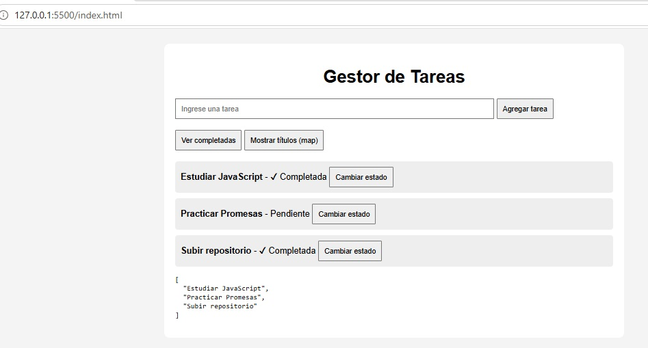
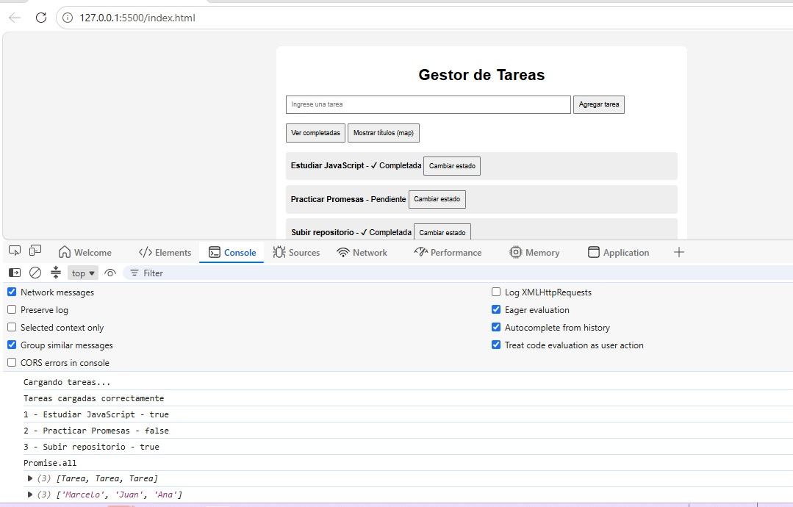
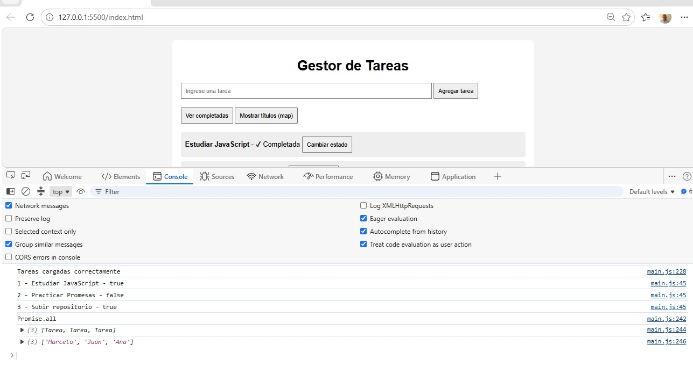

# Tarea Javascript Avanzado

## Descripción

Aplicación de gestión de tareas desarrollada en JavaScript utilizando:

- Clases
- Promesas
- Async/Await
- setTimeout
- map()
- filter()
- find()
- Promise.all()

## Objetivos

Practicar conceptos avanzados de JavaScript relacionados con:

- Programación orientada a objetos
- Manejo de asincronía
- Manipulación de arreglos

## Funcionalidades

- Carga inicial simulada de tareas.
- Alta de nuevas tareas.
- Cambio de estado de tareas.
- Búsqueda mediante find().
- Filtrado de tareas completadas con filter().
- Obtención de títulos mediante map().
- Ejecución paralela de promesas con Promise.all().

## Instalación

1. Clonar repositorio

```bash
git clone URL_DEL_REPOSITORIO
```

2. Abrir index.html en el navegador. usando live server

## Capturas

Capturas de:





## Autor

Marcelo Santillán

## Bibliografía

- 