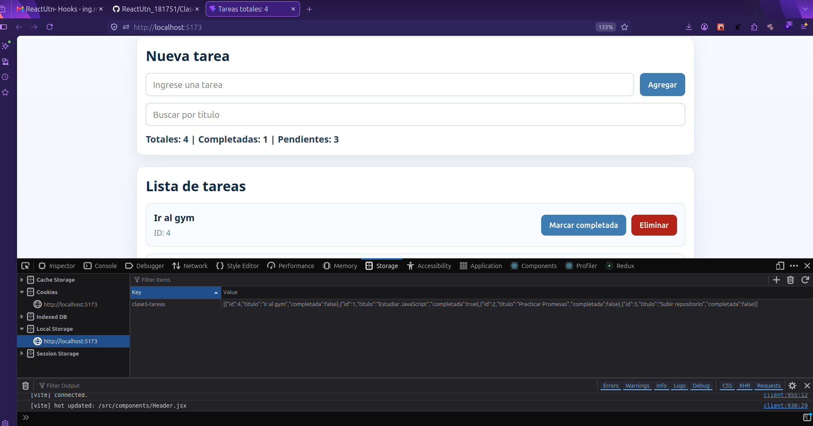

# Clase 5 - Hooks

Proyecto realizado con React + Vite para practicar hooks a partir de la base del gestor de tareas de JavaScript avanzado (Clase 3), migrando la logica a componentes React.

## Funcionalidades

- Agregar tareas con input controlado.
- Marcar tareas como completadas o pendientes.
- Eliminar tareas.
- Buscar tareas por titulo.
- Mostrar cantidades de tareas totales, completadas y pendientes.
- Persistir datos en localStorage con un custom hook.

## Hooks aplicados

- useState: estado del input de nueva tarea y del buscador.
- useRef: foco automatico del input al montar.
- useMemo: optimizacion del filtrado y conteo de tareas completadas.
- useCallback: estabilidad de handlers pasados a hijos.
- useEffect: dentro del custom hook para persistir en localStorage y en App para el titulo dinamico del documento.
- useLocalStorage: custom hook para leer/escribir tareas en localStorage.

## Imagenes de evidencia

Imagen y vista consola Local Storage donde se pueden ver los items agregados: [tarea5LocalStorage.png](tarea5LocalStorage.png)

Pantalla completa: [Tarea5.png](Tarea5.png)

## Instalacion y ejecucion

1. Instalar dependencias:

   npm install

2. Ejecutar en desarrollo:

   npm run dev

3. Generar build:

   npm run build

## Creditos

Alumno: Santillan Marcelo  
Curso: 181751
