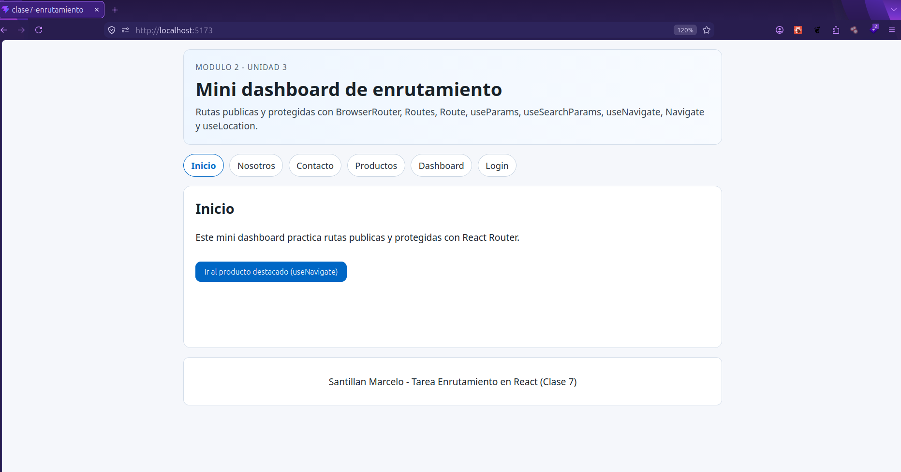
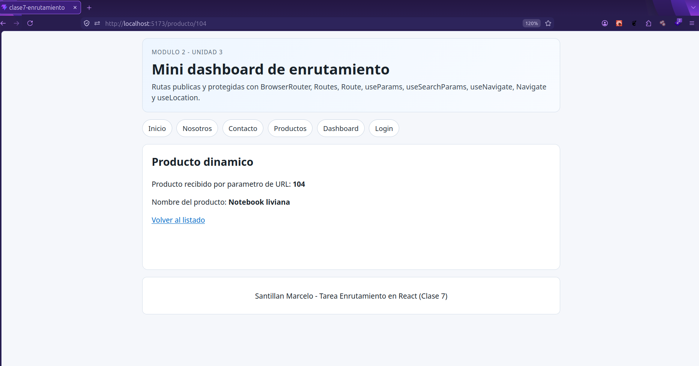
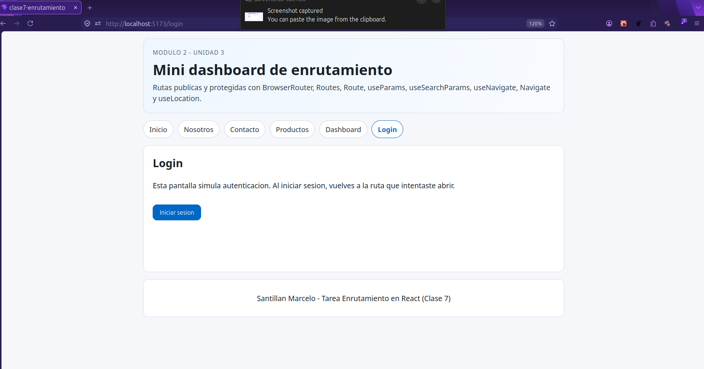
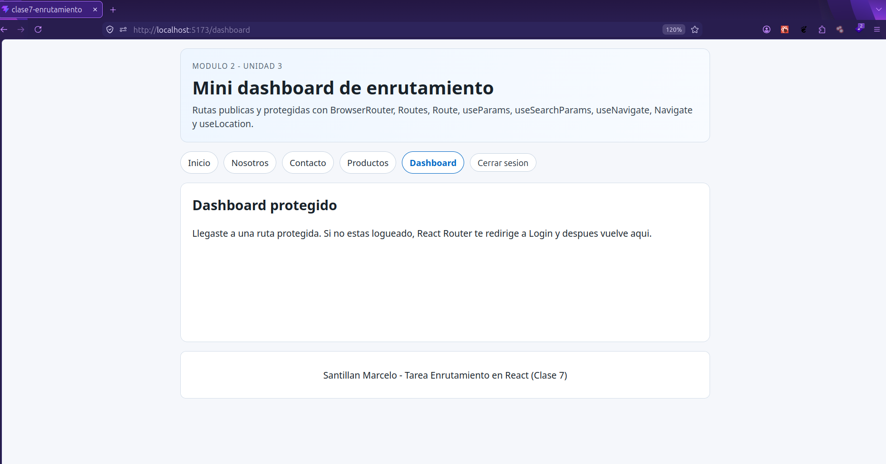
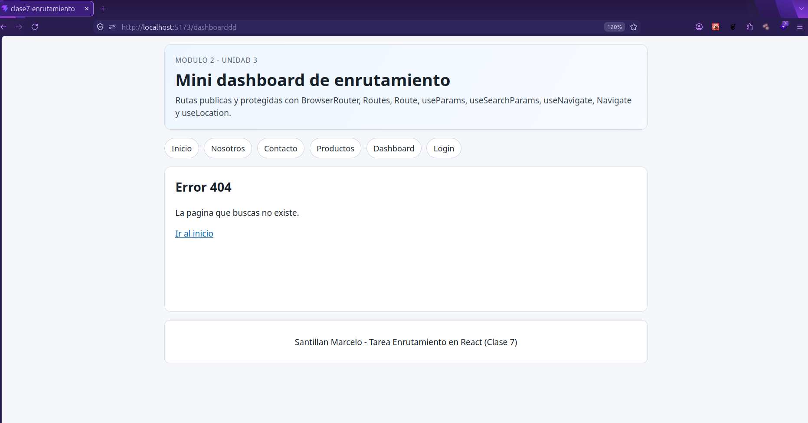

# Mini Dashboard - Enrutamiento React

Trabajo practico de React Router para practicar rutas publicas y protegidas.

## Tecnologias

- React
- Vite
- React Router DOM

## Instalacion y ejecucion

1. Clonar repositorio.
2. Instalar dependencias:

```bash
npm install
```

3. Ejecutar en desarrollo:

```bash
npm run dev
```

## Requisitos implementados

- BrowserRouter, Routes y Route.
- Paginas principales: Inicio, Nosotros y Contacto.
- Navegacion declarativa con Link/NavLink.
- Navegacion programatica con useNavigate.
- Ruta dinamica con useParams: /producto/:id.
- Query params con useSearchParams en /productos?q=...
- Layout con rutas anidadas usando Outlet.
- Ruta protegida con Navigate + useLocation y redireccion post-login.
- Ruta 404.

## Rutas del proyecto

- / (Inicio)
- /nosotros
- /contacto
- /productos
- /producto/:id
- /login
- /dashboard (protegida)

## Evidencias de entrega

- Vista Inicio: 
- Vista ruta dinamica: 
- Vista ruta protegida/login (antes): 
- Vista ruta protegida/login (después): 
- Url inexistente: 

## Creditos del autor

- Estudiante: Marcelo Santillan
- Curso: React UTN
- Modulo/Unidad: Modulo 2 - Unidad 3

## Fuentes

- React Router Docs: https://reactrouter.com/
- MDN URLSearchParams: https://developer.mozilla.org/en-US/docs/Web/API/URLSearchParams
