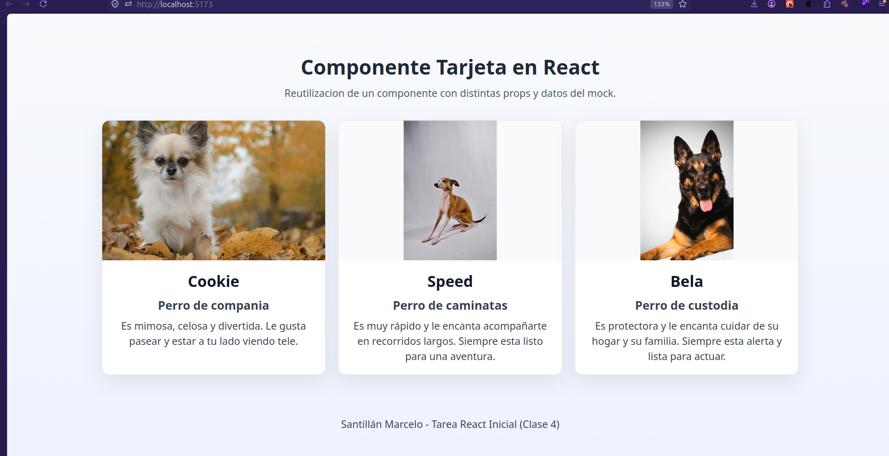

# Clase 4 - React Inicial

Proyecto realizado con React + Vite para practicar componentes reutilizables.

La app muestra una galeria de tarjetas de mascotas usando datos desde un mock local, con estilos responsive para verse en fila en pantallas grandes y apiladas en mobile.

## Captura de pantalla

Acceso a la imagen: [tarea4_pantalla.png](tarea4_pantalla.png)

## Creditos

Alumno: Santillan Marcelo
Curso :181751
