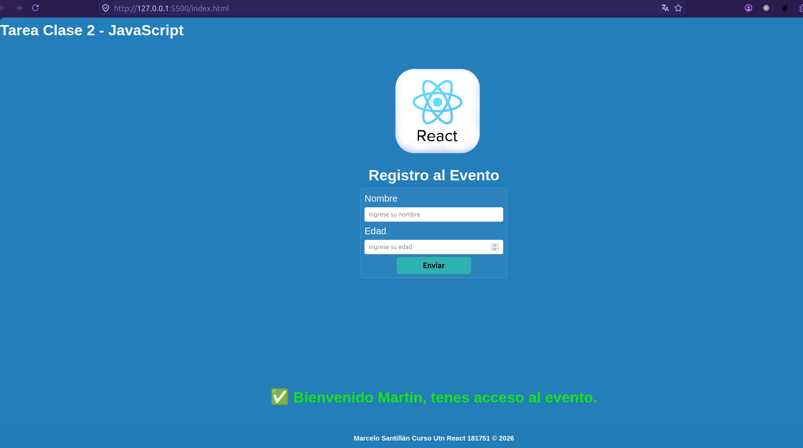
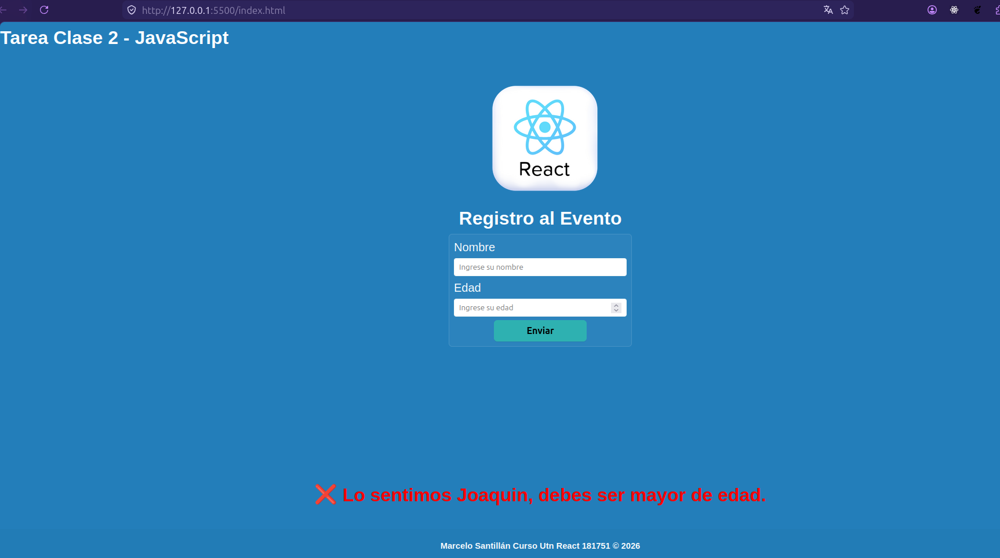

# Tarea Clase 2 - JavaScript

**Alumno:** Marcelo Santillán

**Curso:** React UTN 181751 — 2026

## Descripción breve

Pequeña página de registro al evento que valida la mayoría de edad en el cliente. El formulario pide `nombre` y `edad`; al enviar se evita el comportamiento por defecto del formulario y se muestra un mensaje visual (verde para acceso permitido, rojo para acceso denegado) usando clases CSS aplicadas dinámicamente desde JavaScript.
Los mensaje duran alrededor de 2sg y se borran, lo mismo con los
dos campos que se completan con valores, los cuales se limpian
luego del submit.

## Cómo clonar y ejecutar

1. Clonar el repositorio (reemplazar `<repo_url>` por la URL real):

```bash
git clone <repo_url>
cd Clase2_Javascript
```

2. Abrir en un navegador (opciones):

— usar Live Server en VS Code: abrir la carpeta y seleccionar _Open with Live Server_.

No hay dependencias externas para instalar.

## Capturas de pantalla

Mensaje positivo (mayor de edad):



Mensaje negativo (menor de edad):



## Archivos importantes

- `index.html` — HTML del formulario.
- `app.js` — lógica de validación y mensajes.
- `style.css` — estilos y clases `message--success` / `message--error`.

## Créditos

- Autor: Marcelo Santillán
- Curso: React UTN 181751
- Clase / Unidad: Clase 2 — Validación y manejo de formularios con JavaScript

## Fuentes y bibliografía

Fecha: 2026-06-13
