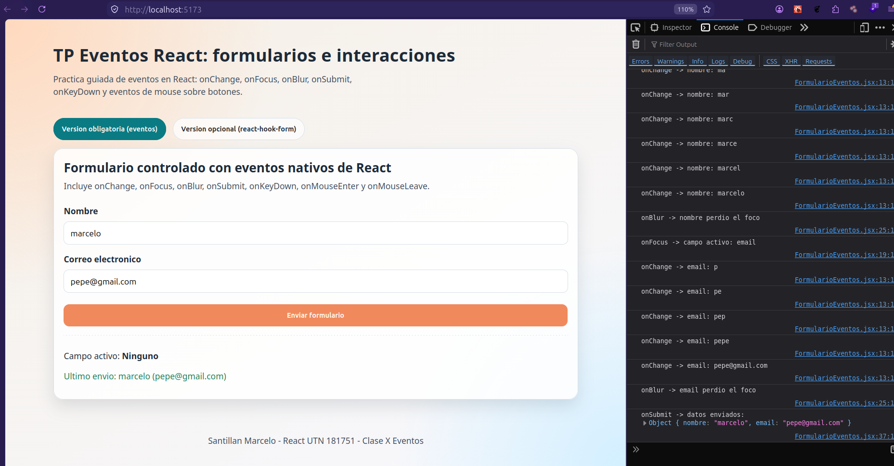
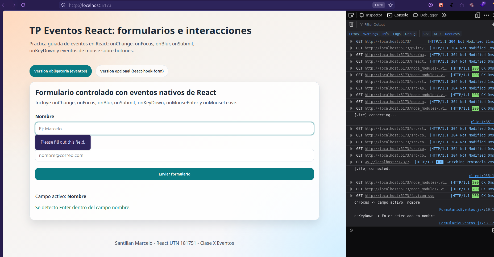
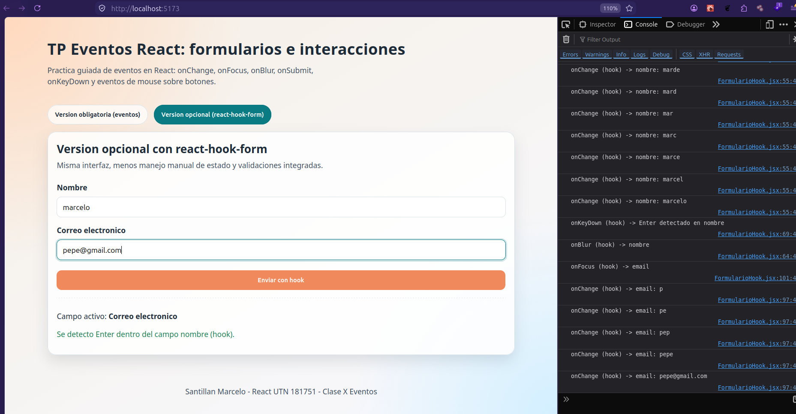

# TP Eventos - React UTN 181751

Resolucion del trabajo practico de eventos en React (modulo 2, unidad 4).

## Tecnologias utilizadas

- React 19
- Vite 8
- react-hook-form (version opcional del formulario)

## Instalacion y ejecucion

1. Instalar dependencias:

```bash
npm install
```

2. Ejecutar en desarrollo:

```bash
npm run dev
```

3. Generar build de produccion:

```bash
npm run build
```

## Validacion de requisitos del enunciado

- Formulario con campo nombre, campo email y boton de envio.
- Eventos implementados: onChange, onFocus, onBlur.
- onSubmit implementado con preventDefault().
- onKeyDown en campo nombre para detectar Enter.
- onMouseEnter y onMouseLeave en boton para cambio visual.
- Version opcional adicional con react-hook-form.

## Evidencias (capturas)

- Vista obligatoria (eventos nativos, carga y submit onMouseLeave):
  
- Vista obligatoria (enter en campo):
  
- Vista obligatoria (submit):
  

- Vista opcional (react-hook-form):
  

## Creditos

Alumno: Santillan Marcelo

Curso: React UTN 181751
