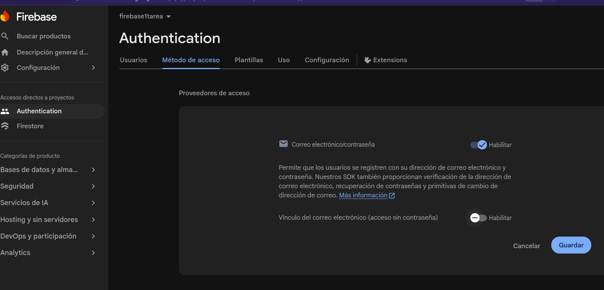
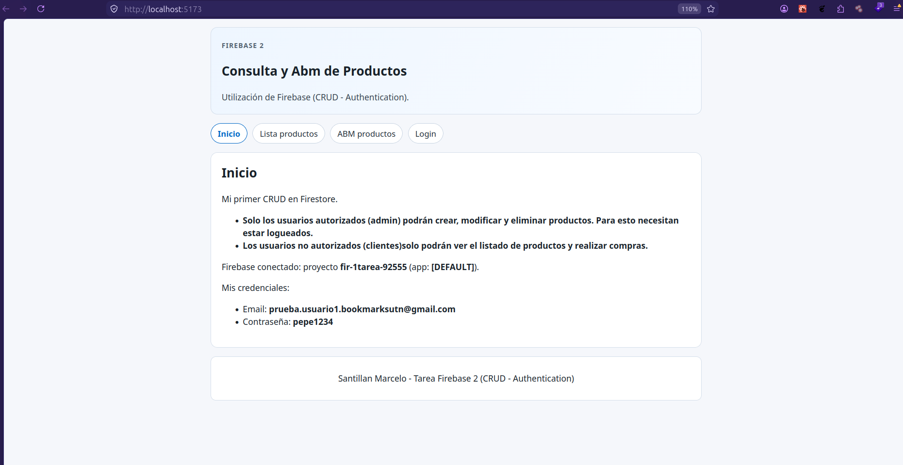
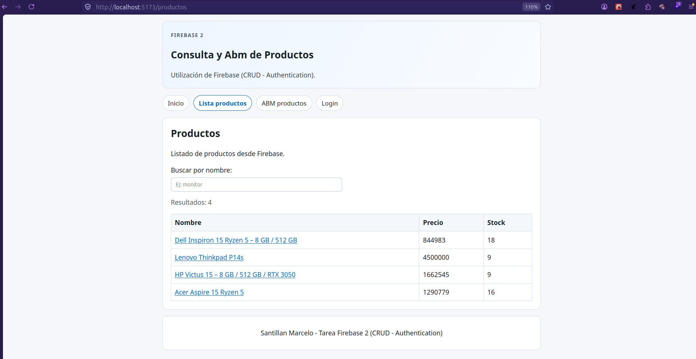
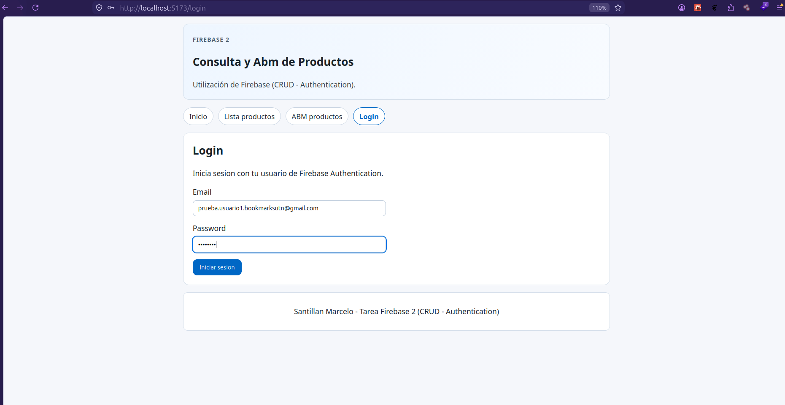
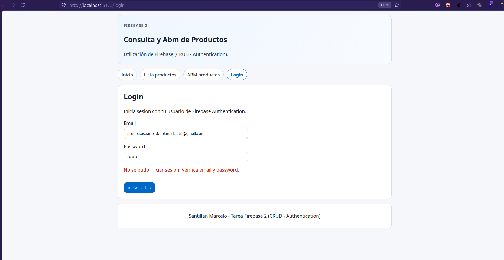
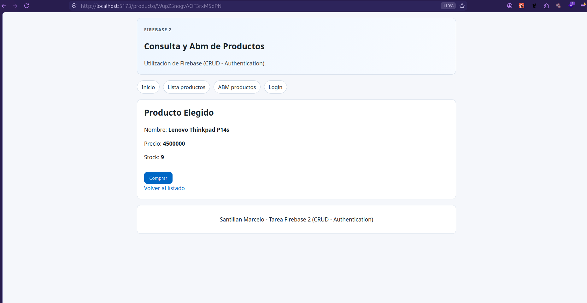
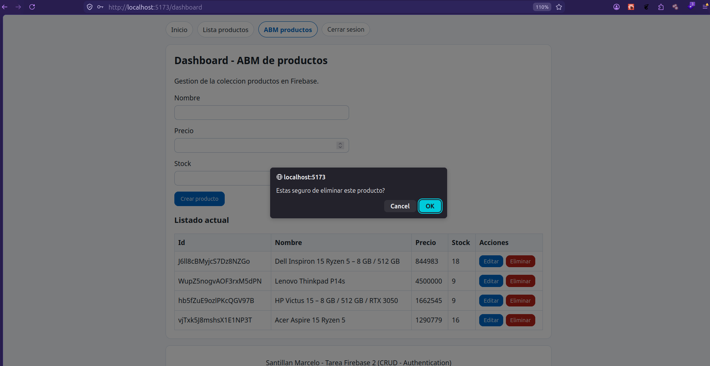
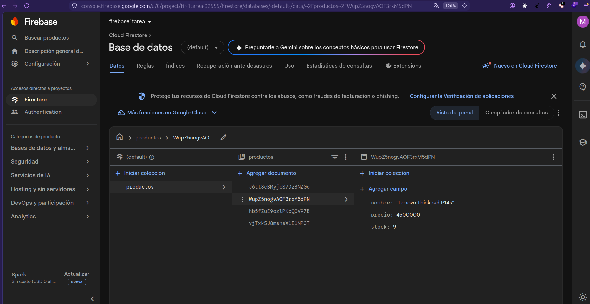

# Tarea Firebase Parte 2 - React + Firebase + Authentication + Context

Proyecto base de React reutilizado y adaptado para cumplir la consigna de Firebase Parte 2 (Modulo 3 - Unidad 2), incluyendo configuracion con variables de entorno, inicializacion unica y verificacion de conexion desde el frontend.

## Tecnologias

- React
- Vite
- React Router DOM
- Firebase SDK (modulo `firebase/app`)

## Pasos de integracion con Firebase

1. Se creo un proyecto en Firebase Console.
2. Se registro una aplicacion Web y se obtuvo el objeto de configuracion.
3. Se registro proveedor y una cuenta de email para autorización Firebase.
4. Se usa Firestore para la collection de productos que se usa en la webapp.
5. Se instalo Firebase en el proyecto:

```bash
npm install firebase
```

4. Se creo el archivo dedicado `src/firebase/FirebaseConfig.js`.
5. Se movieron las claves a variables de entorno (`.env`) con prefijo `VITE_`.
6. Se aplico inicializacion unica usando `getApps()` y `getApp()`.
7. Se realizo una verificacion en frontend mostrando `projectId` y `app.name` en la vista Inicio.

## Instalacion y ejecucion

1. Clonar el repositorio.
2. Instalar dependencias:

```bash
npm install
```

3. Crear el archivo `.env` tomando como base `.env.example`.
4. Ejecutar en desarrollo:

```bash
npm run dev
```

## Buenas practicas aplicadas

- Variables sensibles fuera del codigo fuente (archivo `.env`).
- Inicializacion de Firebase realizada una sola vez.
- Importacion selectiva de modulos (`firebase/app`, solo lo necesario para esta parte).
- Separacion de configuracion en archivo dedicado.

## Verificacion de conexion

En la ruta `/` (Inicio) se muestra el mensaje de conexion con:

- `projectId` de Firebase.
- Nombre de app (`[DEFAULT]`).(Nombre interno de la instancia en SDK: [DEFAULT] (cuando se usa la app por defecto).)

Si estos datos aparecen correctamente, la app React esta vinculada con Firebase.

## Evidencias de entrega

1- Configuración Firebase: aquí se muestran las variables que evidencian la conexión a firebase, comparar con la vista de inicio:

- Vista consola de Firebase: 

2- Configuración Firebase: Dashboard de autenticación:

- Vista consola de Firebase: 

3- Vista inicio: 

4- Vista productos (clientes): 

5- Vista login Ok (admin): 

6- Vista login No Ok: 

7- Vista producto compra (cliente): 

8- Vista filtro de productos (clientes): 

9- Vista Crud productos (admin): 

10- Vista Eliminar producto (admin) : 

11- Vista Modificar producto (admin): 

12- Consola Firestore, vista collection productos: 

## Problemas comunes y resolucion

- Error: Firebase se inicializa mas de una vez.
  - Causa: llamar `initializeApp` en cada import sin control.
  - Solucion: usar `getApps().length ? getApp() : initializeApp(config)`.

- Error: no toma cambios en `.env`.
  - Causa: Vite cachea variables al iniciar.
  - Solucion: reiniciar el servidor de desarrollo.

## Creditos del autor

- Estudiante: Marcelo Santillan
- Curso: React UTN
- Modulo/Unidad: Firebase 2
