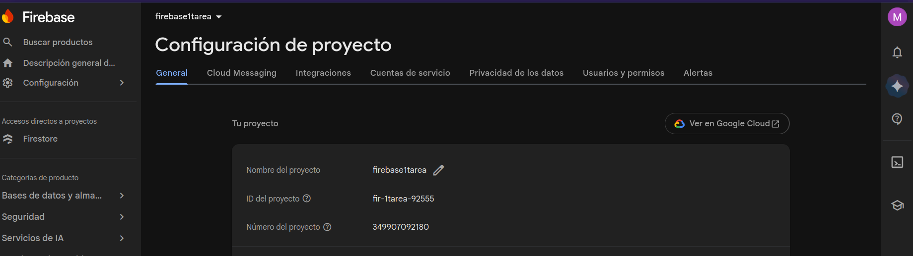
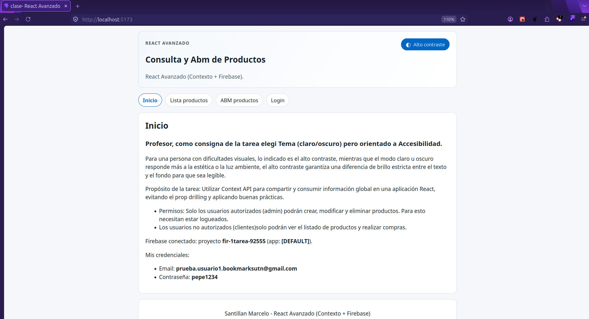
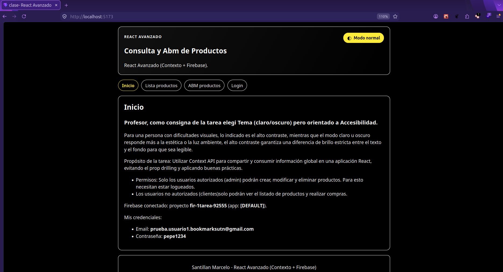
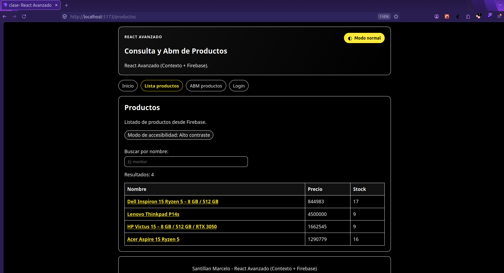
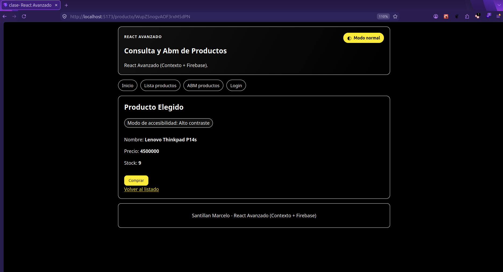
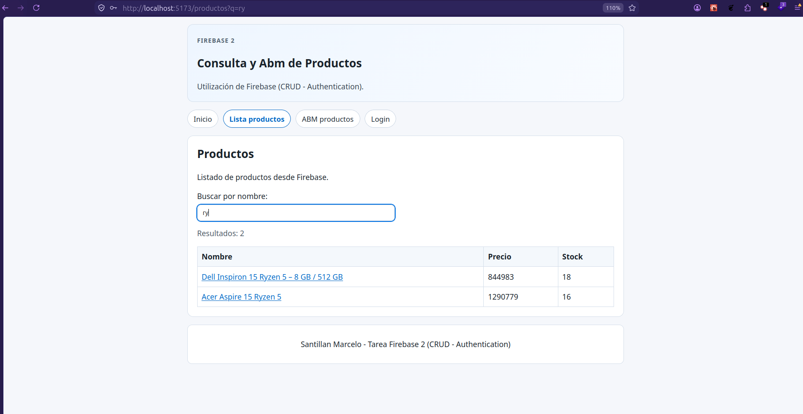
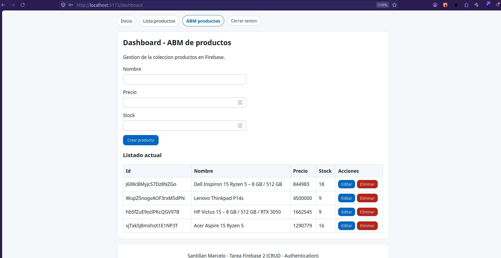
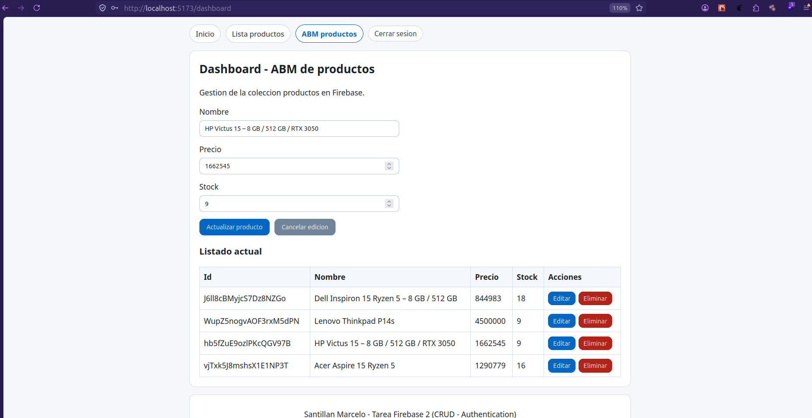
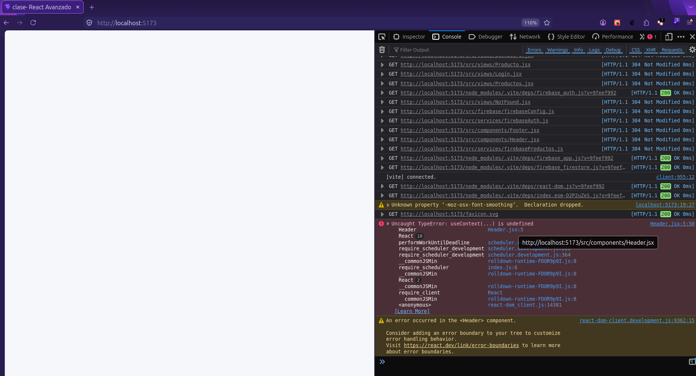

# React avanzado - Contexto global de accesibilidad

Proyecto React adaptado a la consigna de React avanzado (Modulo 3 - Unidad 3), usando Context API para resolver una necesidad de accesibilidad visual: cambiar entre modo normal y modo alto contraste en toda la aplicacion.

## Tecnologias

- React
- Vite
- React Router DOM
- Firebase SDK

## Caso de uso elegido (consigna)

- Informacion global compartida: preferencia visual de accesibilidad.
- Implementacion: `normal` y `high` (alto contraste).
- Objetivo: mejorar legibilidad para personas con dificultades visuales.

Esto cumple la opcion de "tema" de la consigna, orientada especificamente a accesibilidad real (alto contraste), no solo estetica claro/oscuro.

## Context API implementado

- Contexto: `AccessibilityContext`.
- Provider: `AccessibilityProvider`.
- Estado global: `contrastMode`.
- Funciones globales: `toggleContrastMode`.
- Valor derivado: `isHighContrast`.
- Optimizacion: `useMemo` para estabilizar el objeto `value`.

Archivos principales:

- `src/context/AccessibilityContext.jsx`
- `src/main.jsx` (provider en nivel alto)
- `src/components/Header.jsx` (modifica el estado global)
- `src/views/Productos.jsx` (consume y muestra estado)
- `src/views/Producto.jsx` (consume y muestra estado)
- `src/styles/index.css` y `src/styles/app.css` (estilos por modo)

## Pasos de integracion con Firebase (base del proyecto)

1. Se creo un proyecto en Firebase Console.
2. Se registro una aplicacion Web y se obtuvo el objeto de configuracion.
3. Se registro proveedor y una cuenta de email para autorización Firebase.
4. Se usa Firestore para la collection de productos que se usa en la webapp.
5. Se instalo Firebase en el proyecto:

```bash
npm install firebase
```

6. Se creo el archivo dedicado `src/firebase/FirebaseConfig.js`.
7. Se movieron las claves a variables de entorno (`.env`) con prefijo `VITE_`.
8. Se aplico inicializacion unica usando `getApps()` y `getApp()`.
9. Se realizo una verificacion en frontend mostrando `projectId` y `app.name` en la vista Inicio.

## Instalacion y ejecucion

1. Clonar el repositorio.
2. Instalar dependencias:

```bash
npm install
```

3. Crear el archivo `.env` tomando como base `.env.example`.
4. Ejecutar en desarrollo:

```bash
npm run dev
```

## Buenas practicas aplicadas

- Variables sensibles fuera del codigo fuente (archivo `.env`).
- Inicializacion de Firebase realizada una sola vez.
- Importacion selectiva de modulos (`firebase/app`, solo lo necesario para esta parte).
- Separacion de configuracion en archivo dedicado.
- Contexto y provider en archivo independiente.
- Uso de nombres semanticos para estado y funciones del contexto.
- Contexto acotado solo a datos necesarios (modo de contraste).

## Prueba funcional pedida en consigna

1. Cambiar el modo desde el boton del header ("Alto contraste" / "Modo normal").
2. Ir a `/productos`: se ve el badge "Modo de accesibilidad" y cambia la apariencia.
3. Ir a `/producto/:id`: se vuelve a ver el badge y el mismo modo aplicado.
4. Confirmar que el cambio hecho en un componente impacta en los demas consumidores.
5. Verificacion adicional: si se quitara `AccessibilityProvider`, los componentes que usan `useContext(AccessibilityContext)` dejarian de funcionar correctamente (valor `undefined`), tal como describe la consigna.

## Verificacion de conexion

En la ruta `/` (Inicio) se muestra el mensaje de conexion con:

- `projectId` de Firebase.
- Nombre de app (`[DEFAULT]`).(Nombre interno de la instancia en SDK: [DEFAULT] (cuando se usa la app por defecto).)

Si estos datos aparecen correctamente, la app React esta vinculada con Firebase.

## Instalacion y ejecucion

1. Clonar el repositorio.
2. Instalar dependencias:

```bash
npm install
```

3. Crear el archivo `.env` tomando como base `.env.example`.
4. Ejecutar en desarrollo:

```bash
npm run dev
```

## Evidencias de entrega

1- Configuración Firebase: aquí se muestran las variables que evidencian la conexión a firebase, comparar con la vista de inicio:

- Vista consola de Firebase: 

2- Configuración Firebase: Dashboard de autenticación:

- Vista consola de Firebase: 

3- Vista inicio modo normal: 
4- Vista inicio con alto contraste: 

5- Vista productos (clientes) con alto contraste y badge: 

6- Vista producto compra (cliente): 
7- Vista producto compra (cliente) con alto contraste y badge: 

8- Vista filtro de productos (clientes): 

9- Vista Crud productos (admin): 

10- Vista Eliminar producto (admin) : 

11- Vista Modificar producto (admin): 

12- Consola Firestore, vista collection productos: 

13- Verificacion adicional: si se quitara `AccessibilityProvider`, los componentes que usan `useContext(AccessibilityContext)` dejarian de funcionar correctamente (valor `undefined`): 

## Problemas comunes y resolucion

- Error: Firebase se inicializa mas de una vez.
  - Causa: llamar `initializeApp` en cada import sin control.
  - Solucion: usar `getApps().length ? getApp() : initializeApp(config)`.

- Error: no toma cambios en `.env`.
  - Causa: Vite cachea variables al iniciar.
  - Solucion: reiniciar el servidor de desarrollo.

## Creditos del autor

- Estudiante: Marcelo Santillan
- Curso: React UTN
- Modulo/Unidad: React avanzado - Context API
